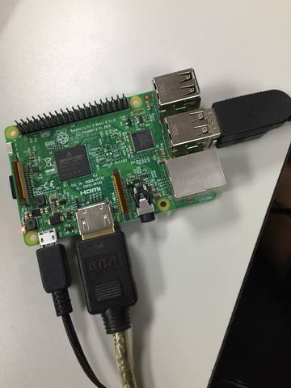
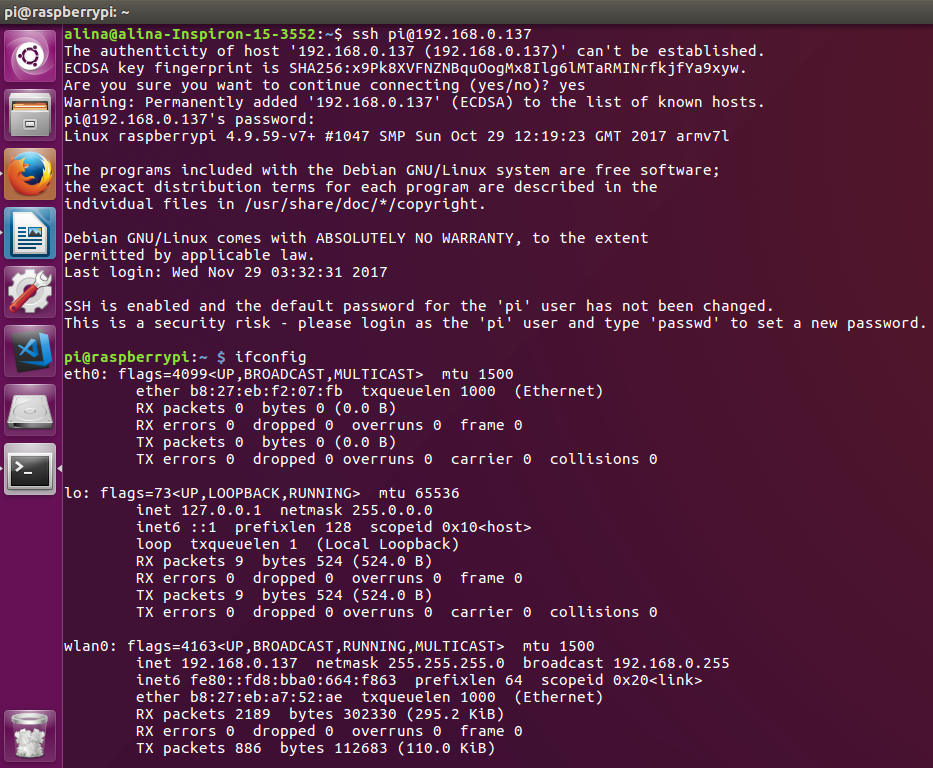
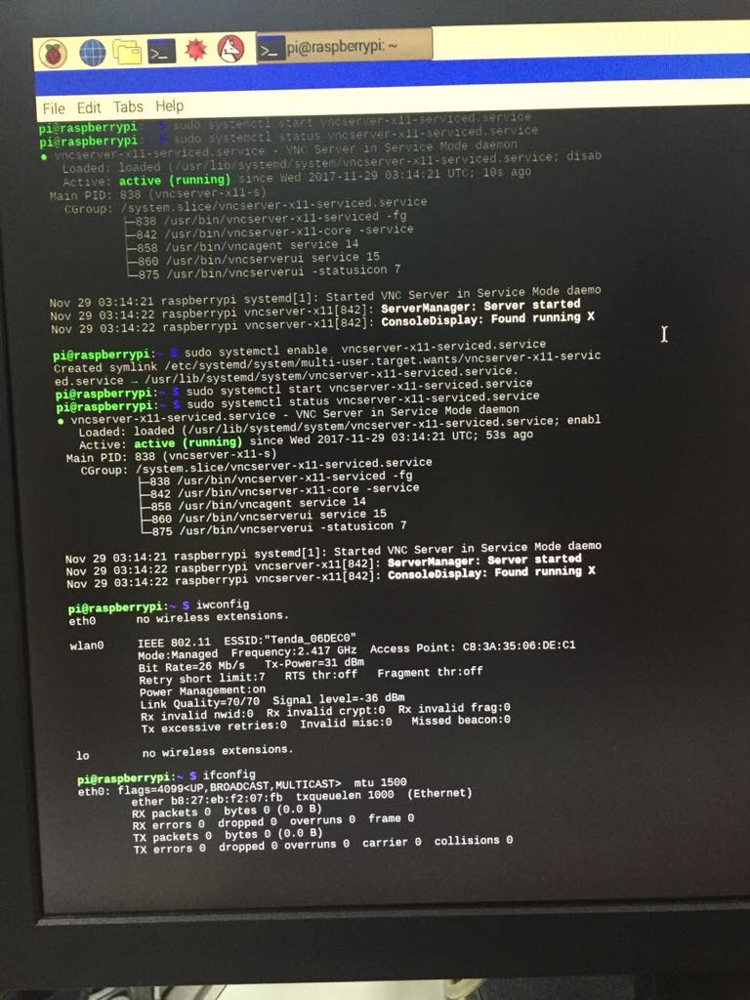
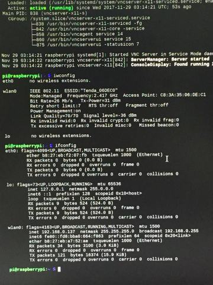
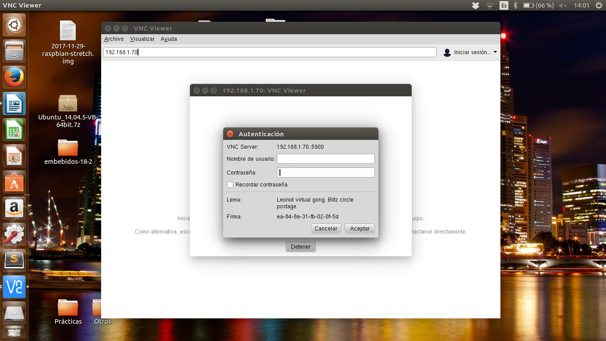
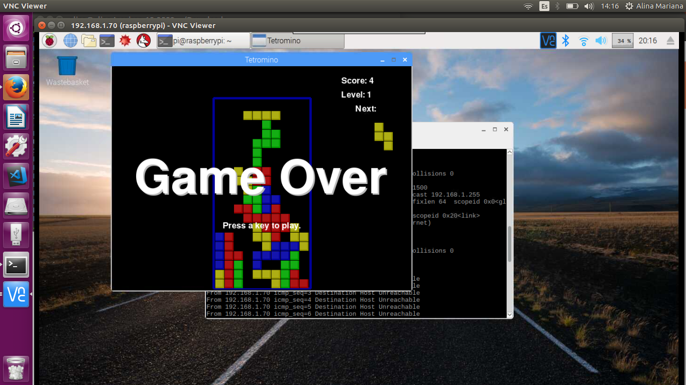
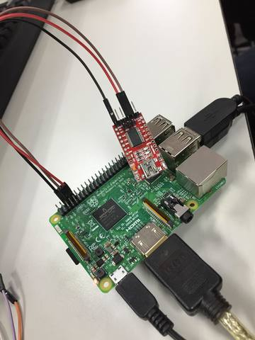
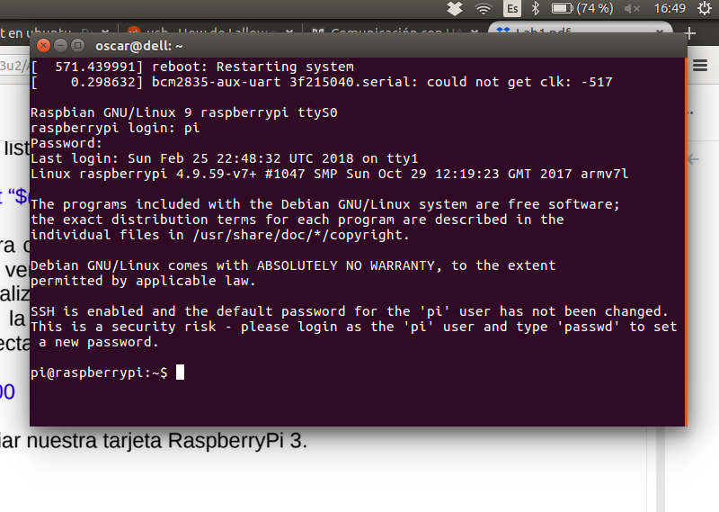

#PRÁCTICA 1

####Equipo 10

####Integrantes:
#####-González González Óscar Arturo  
#####-Pérez Soberanes Alina Mariana

##1. Imagen de conexión SSH:
Conexión física de la Raspberry, con el monitor, teclado y mouse (figura 1):

Figura 1.

Después de la configuración de la red y la activación del servicio de SSH, en la tarjeta Raspberry. Se estableció la conexión SSH, desde la computadora personal (figura 2):

Figura 2.

##2. Imagen de conexión VNC:

Configuración de VNC en la tarjeta Raspberry (figura 3):

Figura 3.

Consulta de la configuración de red (Figura 4):

Figura 4.

En la figura 5, se muestra el inicio de sesión desde la computadora personal:

Figura 5.

Pruebas de la conexión VNC desde la computadora personal (figura 6):

Figura 6.

##3. Imagen de conexión UART:

Conexión física del módulo FT232 (figura 7):

Figura 7.

Después de realizar la configuración para conexión por UART. Se ejecutó en consola el comando $ screen /dev/ttyUSB0 115200 y se reinició la Tarjeta Raspberry. En la figura 8 se muestra la conexión a través de UART, desde la computadora personal:

Figura 8.

